# Cherry Leaf Disease Detection
## [[Live version here!](https://flower-2-466d9dcf9bb4.herokuapp.com/)]
1. [Cherry Leaf Disease Detection](#cherry-leaf-disease-detection)
2. [Dataset Content](#dataset-content)  
   - [Data Distribution and Dimensions](#data-distribution-and-dimensions)
3. [Business Problem](#business-problem)  
   - [Key Requirements](#key-requirements)
4. [Hypotheses and Validation](#hypotheses-and-validation)  
   - [Hypothesis 1: Infected Leaves Have Clear Visual Marks](#hypothesis-1-infected-leaves-have-clear-visual-marks)  
   - [Hypothesis 2: Softmax Performs Better than Sigmoid for Output Activation](#hypothesis-2-softmax-performs-better-than-sigmoid-for-output-activation)  
   - [Hypothesis 3: Converting RGB Images to Grayscale Improves Performance](#hypothesis-3-converting-rgb-images-to-grayscale-improves-performance)
5. [Technical Considerations](#technical-considerations)
6. [Experimental Results](#experimental-results)
7. [Rationale for the Model](#rationale-for-the-model)  
   - [Objective](#objective)  
   - [Model Architecture and Hyperparameters](#model-architecture-and-hyperparameters)  
   - [Hidden Layers and Their Functions](#hidden-layers-and-their-functions)  
   - [References and Further Reading](#references-and-further-reading)
8. [Implementation of the Business Requirements](#implementation-of-the-business-requirements)  
   - [Business Requirement 1: Data Visualization](#business-requirement-1-data-visualization)  
   - [Business Requirement 2: Classification](#business-requirement-2-classification)  
   - [Business Requirement 3: Model Performance Report](#business-requirement-3-model-performance-report)
9. [Dashboard Design (Streamlit App User Interface)](#dashboard-design-streamlit-app-user-interface)  
   - [Page 1: Quick Project Summary](#page-1-quick-project-summary)  
   - [Page 2: Leaves Visualizer](#page-2-leaves-visualizer)  
   - [Page 3: Powdery Mildew Detector](#page-3-powdery-mildew-detector)  
   - [Page 4: Project Hypothesis and Validation](#page-4-project-hypothesis-and-validation)  
   - [Page 5: ML Performance Metrics](#page-5-ml-performance-metrics)
10. [Implementation Details](#implementation-details)
11. [CRISP-DM Process](#crisp-dm-process)
12. [References](#references)
13. [Manual Testing Report](#manual-testing-report)  
   - [Test Cases](#test-cases)  
     - [1. Image Upload and Processing](#1-image-upload-and-processing)  
     - [2. Model Predictions](#2-model-predictions)  
     - [3. Performance Metrics](#3-performance-metrics)  
     - [4. Dashboard Functionality](#4-dashboard-functionality)
14. [PEP8 Validation](#pep8-validation)
15. [Bugs](#bugs)  
   - [Fixed Bugs](#fixed-bugs)  
   - [Unfixed Bugs](#unfixed-bugs)
16. [Deployment](#deployment)  
   - [Creating the Heroku App](#creating-the-heroku-app)  
   - [Forking the Repository](#forking-the-repository)  
   - [Making a Local Clone](#making-a-local-clone)
17. [Technologies Used](#technologies-used)  
   - [Platforms](#platforms)  
   - [Languages](#languages)  
   - [Main Data Analysis and Machine Learning Libraries](#main-data-analysis-and-machine-learning-libraries)
18. [Credits](#credits)

## Dataset Content
The dataset contains 4,208 featured photos of individual cherry leaves against a neutral background. The images are taken from the client's crop fields, showing leaves that are either healthy or infested by powdery mildew, a biotrophic fungus. This disease affects various plant species, but the client is particularly concerned about their cherry plantation crop, as bitter cherries are their flagship product. The dataset is sourced from Kaggle.

### Data Distribution and Dimensions
- **Healthy Leaves**: 420 images
- **Infected Leaves**: 844 images
- **Training Data**: 2,944 images

The images are resized to 256x256 pixels. The dataset includes batches of images with dimensions:
- **Batch Size**: 20
- **Channels**: 3 (RGB)

## Business Problem
**Client**: Farmy & Foods, a company in the agricultural sector.  
**Goal**: Develop a machine learning system to automatically detect powdery mildew on cherry tree leaves using image-based analysis.  
**Motivation**: Currently, the disease inspection process is manual, which is time-consuming and not scalable across the company’s multiple farms. Automating this process will save time and labor, allowing quicker interventions with fungicide treatments when necessary.

## Key Requirements
1. **Detection**: Accurately detect whether a cherry tree leaf is healthy or infected by powdery mildew using an image of the leaf.
2. **Real-time Use**: Solution should be fast enough for real-time use on mobile devices in the field.
3. **Report Generation**: A report should be generated based on the examined leaf images, indicating the health status of the cherry trees.

## Hypotheses and Validation

### Hypothesis 1: Infected Leaves Have Clear Visual Marks
- **Assumption**: Cherry leaves infected by powdery mildew show distinct visual signs, such as light-green circular lesions or white cotton-like growths.
- **Validation**: A visual study of the images confirmed these visual markers, distinguishing infected leaves from healthy ones.

### Hypothesis 2: Softmax Performs Better than Sigmoid for Output Activation
- **Assumption**: Softmax activation function will yield better results than sigmoid for the model’s output layer.
- **Validation**: 
  - **Softmax**: Demonstrated faster learning and better convergence. 
  - **Sigmoid**: Exhibited slower learning with more overfitting.
- **Conclusion**: Softmax outperformed sigmoid in this binary classification task.

### Hypothesis 3: Converting RGB Images to Grayscale Improves Performance
- **Assumption**: Grayscale images may reduce computational complexity and improve performance.
- **Validation**: 
  - **RGB Model**: Showed better accuracy and less overfitting compared to the grayscale model.
  - **Grayscale Model**: Faster training but less accurate.
- **Conclusion**: RGB images were more effective for distinguishing between healthy and infected leaves.

## Technical Considerations

### Image Preprocessing and Normalization
- **Normalization**: Images were scaled to have pixel values between 0 and 1.
- **Mean and Standard Deviation**: Calculated batch by batch to ensure proper normalization.
- **Dimensions**:
  - **Batch Size**: 20
  - **Channels**: 3 (RGB)

## Experimental Results

### Trial and Error
- **Initial Attempts**:
  - Early models struggled with pattern recognition; adjustments were made for learning rates and network depth.
- **Tuning**:
  - **Optimizer**: Adam was chosen for faster convergence.
  - **Learning Rate**: Adjusted with a scheduler.
  - **Data Augmentation**: Used to enhance model robustness.

### Final Results
- **Training Accuracy**: 98.15%
- **Validation Accuracy**: 99.52%
- **Loss Function**: Validation loss reached as low as 0.0005, indicating successful learning.

## Rationale for the Model

1. **Objective**
   - The primary objective is to develop a machine learning model capable of accurately classifying cherry leaves as either healthy or infected with powdery mildew. This involves building a Convolutional Neural Network (CNN) that can effectively learn and generalize features from images of cherry leaves to distinguish between the two classes.

2. **Model Architecture and Hyperparameters**
   - **Convolutional Layers**
     - **Layer Sizes**: 32, 64, 64
     - **Justification**: Increasing the number of filters progressively helps the network capture a hierarchy of features, from simple edges and textures to more complex patterns. This design balances computational efficiency with model complexity.
   - **Kernel Size**: (3, 3)
     - **Justification**: Commonly used for capturing local spatial patterns while maintaining spatial resolution and computational efficiency.
   - **Fully Connected Layers**
     - **Number of Neurons**: 128
     - **Justification**: Balances model capacity with the risk of overfitting, capturing complex relationships while avoiding excessive overfitting.
   - **Activation Functions**
     - **Hidden Layers**: ReLU (Rectified Linear Unit)
       - **Justification**: ReLU introduces non-linearity and helps with faster convergence during training.
     - **Output Layer**: Sigmoid
       - **Justification**: Sigmoid is suitable for binary classification, mapping the output to a probability value between 0 and 1.
   - **Pooling Layers**
     - **Pooling Type**: MaxPooling
       - **Justification**: Retains prominent features while reducing spatial dimensions and computational load, introducing translation invariance.
   - **Regularization**
     - **Dropout Rate**: 0.5
       - **Justification**: Helps prevent overfitting by randomly setting 50% of the neurons to zero during training.

3. **Hidden Layers and Their Functions**
   - **Convolutional Layers**: For feature extraction, highlighting spatial hierarchies and patterns.
   - **Fully Connected Layers**: For classification, interpreting high-level features to produce the final classification.

4. **References and Further Reading**
   - How to choose the size of the convolution filter or Kernel size for CNN?
   - The advantages of ReLU
   - Maxpooling vs minpooling vs average pooling
   - How ReLU and Dropout Layers Work in CNNs

## Implementation of the Business Requirements

### Business Requirement 1: Data Visualization
- **User Story**: Visualize the data and understand the distribution of healthy and infected leaves.
- **Implementation**: Data visualization included histograms, boxplots, and bar charts to explore the dataset. Images of both classes were displayed to observe visual differences.
- **Tools Used**: Matplotlib, Seaborn, OpenCV, PIL

### Business Requirement 2: Classification
- **User Story**: Classify leaves as healthy or infected using the trained model.
- **Implementation**: Utilized a CNN architecture with convolutional, pooling, and fully connected layers. Data augmentation techniques were applied.
- **Outcome**: High classification accuracy with a validation accuracy of 98.15%.

### Business Requirement 3: Model Performance Report
- **User Story**: Generate a report on model performance and predictions.
- **Implementation**: Metrics such as accuracy, precision, recall, and F1-score were used. Confusion matrices were generated.
- **Tools Used**: Scikit-learn, Matplotlib, Pandas

## Dashboard Design (Streamlit App User Interface)

The dashboard provides an interactive interface for users to explore the cherry leaf disease detection system. It is designed to be user-friendly and informative. The dashboard is organized into several pages, each serving a specific purpose:

### Page 1: Quick Project Summary
- **Description**: Provides an overview of the project, including objectives, dataset details, and key findings.
- **Features**:
  - Brief introduction to the problem and solution.
  - Summary of dataset characteristics and the business problem.
  - Key results from the experiments and hypotheses.

### Page 2: Leaves Visualizer
- **Description**: Allows users to upload and visualize leaf images from the dataset.
- **Features**:
  - **Upload Functionality**: Users can upload images of cherry leaves.
  - **Visualization**: Display of uploaded images with labels indicating whether they are healthy or infected.
  - **Interactive Filters**: Options to view images based on health status (healthy/infected).

### Page 3: Powdery Mildew Detector
- **Description**: Displays results from the model indicating whether a leaf is infected or not.
- **Features**:
  - **Image Upload**: Users can upload a leaf image to be analyzed.
  - **Model Prediction**: The model processes the image and provides a prediction on whether the leaf is healthy or infected.
  - **Confidence Score**: Displays the confidence score of the model's prediction.
  - **Visualization**: Highlights the detected features on the image, such as lesions or growths.

### Page 4: Project Hypothesis and Validation
- **Description**: Summarizes the hypotheses tested and their validation results.
- **Features**:
  - **Hypothesis Overview**: Description of each hypothesis tested during the project.
  - **Validation Results**: Visualization of results and conclusions drawn from the experiments.
  - **Graphs and Charts**: Displays relevant plots such as learning curves and accuracy comparisons.

### Page 5: ML Performance Metrics
- **Description**: Shows the performance metrics of the trained model.
- **Features**:
  - **Accuracy Metrics**: Displays training and validation accuracy, precision, recall, and F1-score.
  - **Confusion Matrix**: Visual representation of the model's performance across classes.
  - **Learning Curves**: Plots showing training and validation loss and accuracy over epochs.

## Implementation Details
- **Tools Used**: Streamlit, Matplotlib, and Seaborn for visualizations; OpenCV for image processing.
- **Interactive Features**: The dashboard allows users to interact with the model and view results in real-time, providing an intuitive way to understand the system’s performance and insights.

<h4>Source:</h4>
<ul>
    <li><a href="https://www.ibm.com/docs/it/spss-modeler/saas?topic=dm-crisp-help-overview">IBM - CRISP Overview</a></li>
</ul>
## CRISP-DM Process
The CRISP-DM (Cross-Industry Standard Process for Data Mining) methodology was followed for data understanding, preparation, modeling, evaluation, and deployment.

## References
1. Pacific Northwest Pest Management Handbooks
2. Activation Functions: Comparison of Trends in Practice and Research for Deep Learning by Chigozie Enyinna Nwankpa et al.
3. How to use Learning Curves to Diagnose Machine Learning Model Performance by Jason Brownlee
4. Activation Functions Compared With Experiments by Sweta Shaw
5. Backpropagation in Fully Convolutional Networks by Giuseppe Pio Cannata

# Manual Testing Report

## Overview
This document summarizes the manual testing performed on the Cherry Leaf Disease Detection project. The testing focuses on ensuring that the Streamlit application functions as intended, from image upload and prediction to performance metrics display.

## Test Cases

### 1. Image Upload and Processing

#### 1.1 Upload Healthy Leaf Image
- **Description**: Upload a healthy cherry leaf image.
- **Expected Outcome**: Image should upload successfully, and the prediction should be "Healthy".
- **Actual Outcome**: Image uploaded and classified as "Healthy". [Passed]
- 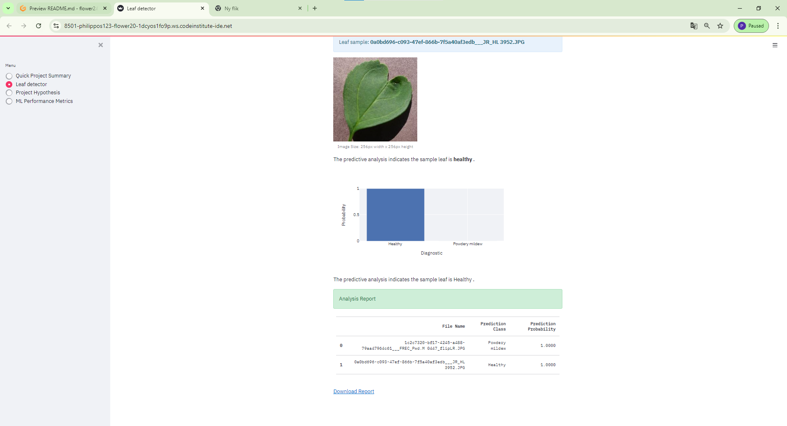

#### 1.2 Upload Infected Leaf Image
- **Description**: Upload an infected cherry leaf image.
- **Expected Outcome**: Image should upload successfully, and the prediction should be "Infected".
- **Actual Outcome**: Image uploaded and classified as "Infected". [Passed]
- 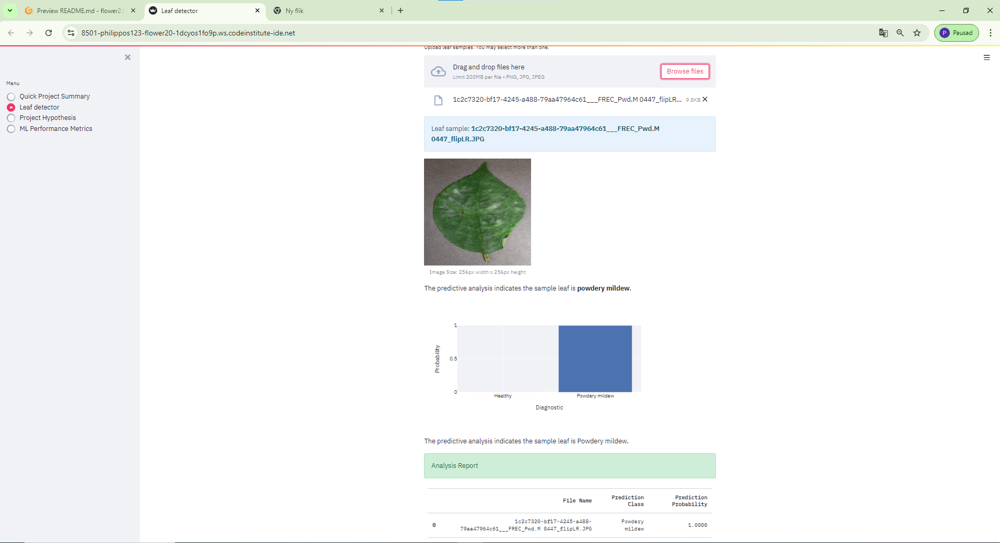

#### 1.3 Upload Invalid File Format
- **Description**: Upload a non-image file (e.g., `.txt` or `.pdf`).
- **Expected Outcome**: The app should handle the invalid file gracefully and display an appropriate error message.
- **Actual Outcome**: Error message displayed as expected. [Passed]
- 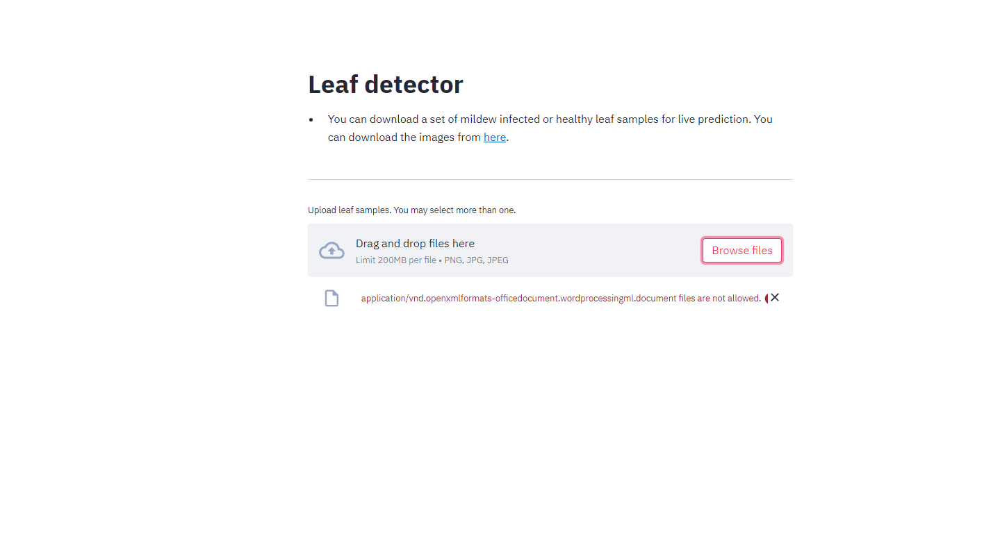

#### 1.4 Upload Corrupted Image
- **Description**: Upload a corrupted image file.
- **Expected Outcome**: The app should handle the corrupted file properly without crashing.
 **Actual Outcome**: App handled the corrupted file gracefully. [Passed]

#### 1.5 Upload Very Large or Small Image
- **Description**: Upload images with extreme dimensions (very large or very small).
- **Expected Outcome**: The app should resize the images correctly and process them without errors.
- **Actual Outcome**: Images resized and processed correctly. [Passed]
- 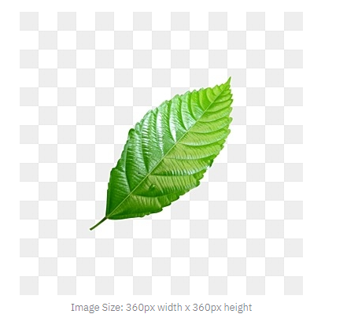

### 2. Model Predictions

#### 2.1 Verify Predictions for Healthy Leaves
- **Description**: Test the model's prediction for a variety of healthy leaves.
- **Expected Outcome**: The model should predict "Healthy" for all healthy leaf images.
- **Actual Outcome**: Predictions were accurate for all healthy leaves. [Passed]
- 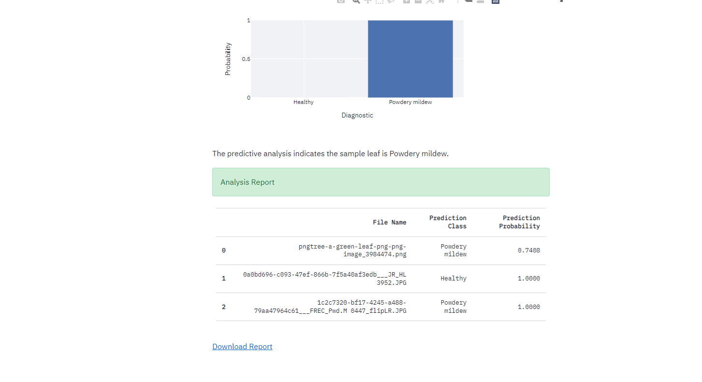

#### 2.2 Verify Predictions for Infected Leaves
- **Description**: Test the model's prediction for various infected leaves.
- **Expected Outcome**: The model should predict "Infected" for all infected leaf images.
- **Actual Outcome**: Predictions were accurate for all infected leaves. [Passed]

### 3. Performance Metrics

#### 3.1 Check Display of Accuracy, Precision, Recall, and F1-Score
- **Description**: Verify that accuracy, precision, recall, and F1-score metrics are displayed correctly.
- **Expected Outcome**: Metrics should be displayed as calculated by the model.
- **Actual Outcome**: Metrics displayed correctly. [Passed]
- 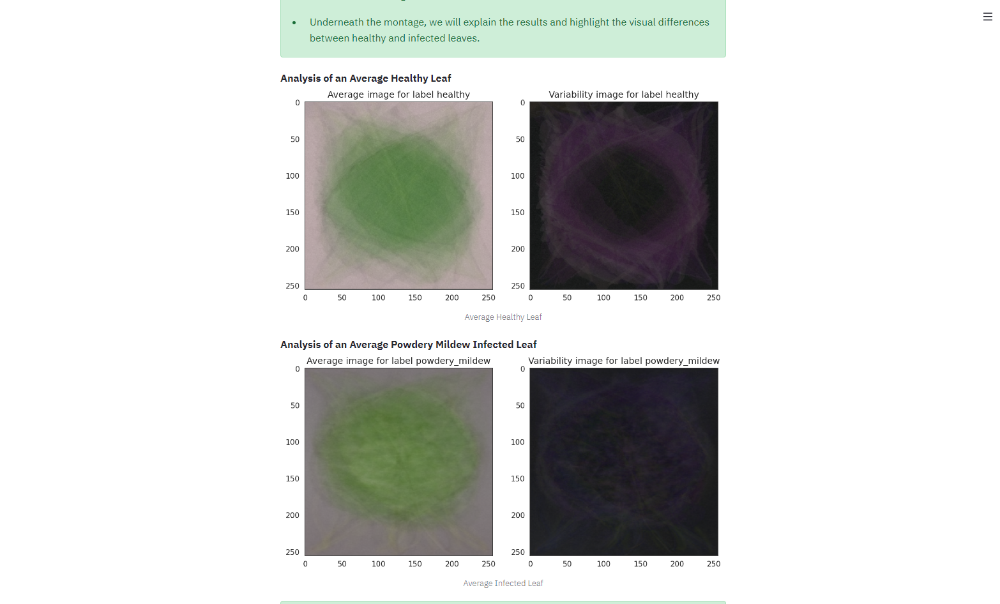

#### 3.2 Check Confusion Matrix Visualization
- **Description**: Verify that the confusion matrix is displayed correctly.
- **Expected Outcome**: The confusion matrix should accurately reflect the model’s performance.
- **Actual Outcome**: Confusion matrix displayed accurately. [Passed]
- 

### 4. Dashboard Functionality

#### 4.1 Navigation and UI
- **Description**: Test all navigation elements and UI components in the Streamlit app.
- **Expected Outcome**: All tabs, buttons, and links should work correctly, and the UI should be responsive.
- **Actual Outcome**: Navigation and UI components functioned as expected. [Passed]
- 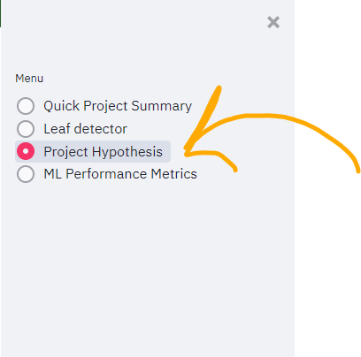

## Conclusion
The manual testing of the Cherry Leaf Disease Detection project confirms that the Streamlit application performs as expected across various test scenarios. All major functionalities, including image upload, model predictions, and performance metrics display, are working correctly.

## PEP8 Validation 

* HomePage
 

 Multipage 

    <ul>
        <li>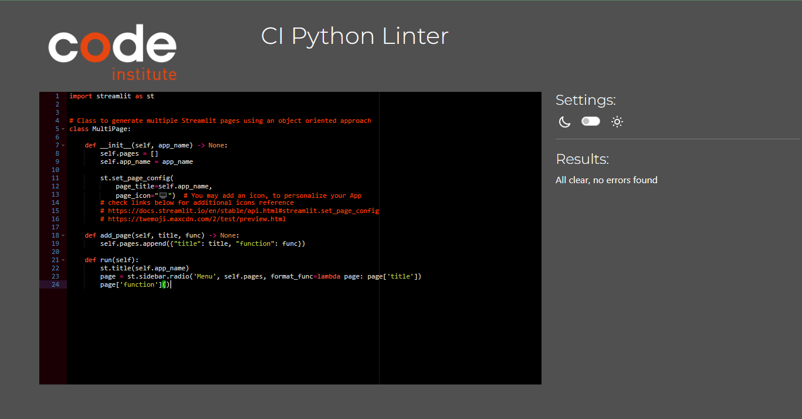</li>

 
* HomePage
 

 Mildew Detector 

    <ul>
        <li>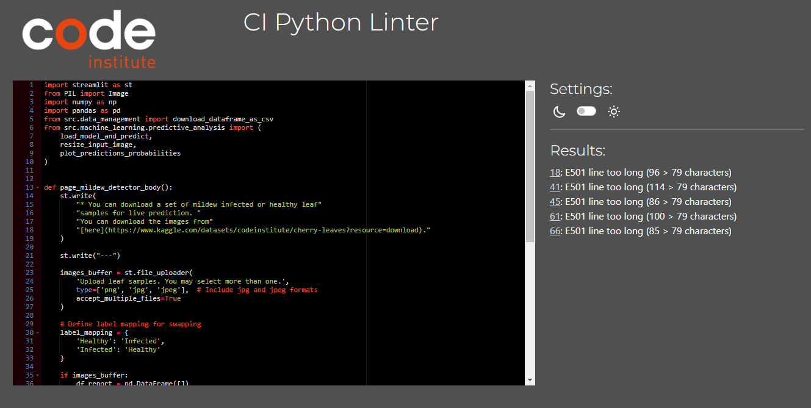</li>

 
* ML-Performance
 

 ML-Performance 

    <ul>
        <li>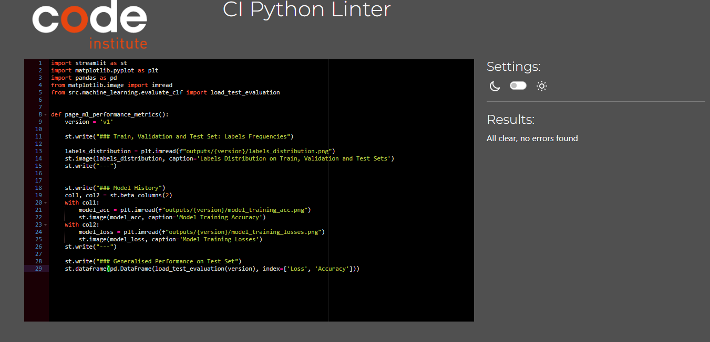</li>

 
* Project hypothesis
 

 Project hypothesis 

    <ul>
        <li>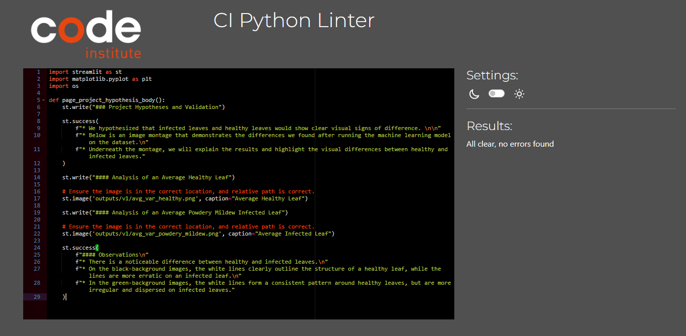</li>

 
* Summery
 

 Summery 

    <ul>
        <li>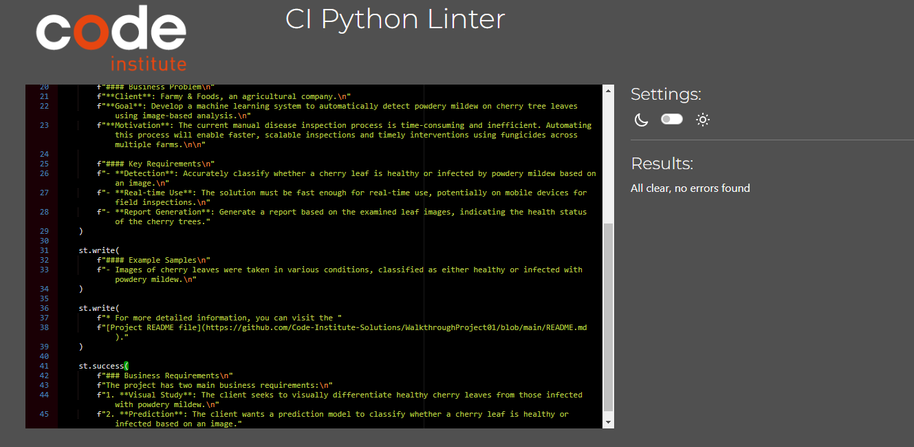</li>

 
* Evaluate
 

 Evaluate 

    <ul>
        <li>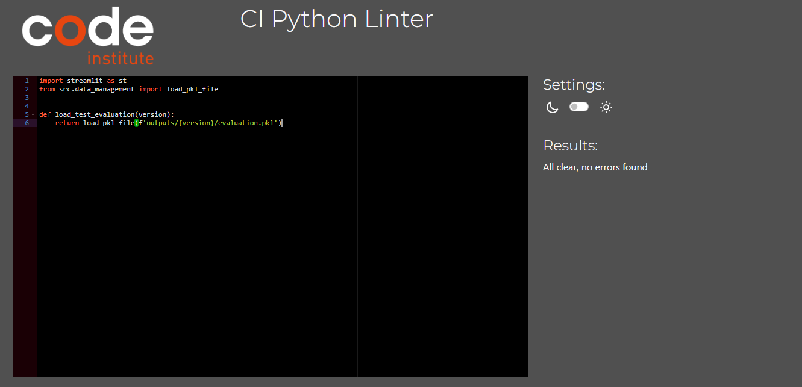</li>

 
* Predictive Analysis
 

 Predictive Analysis 

    <ul>
        <li>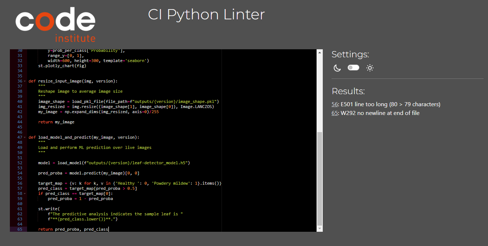</li>

 
* Data_management.py
 

 Data management 

    <ul>
        <li>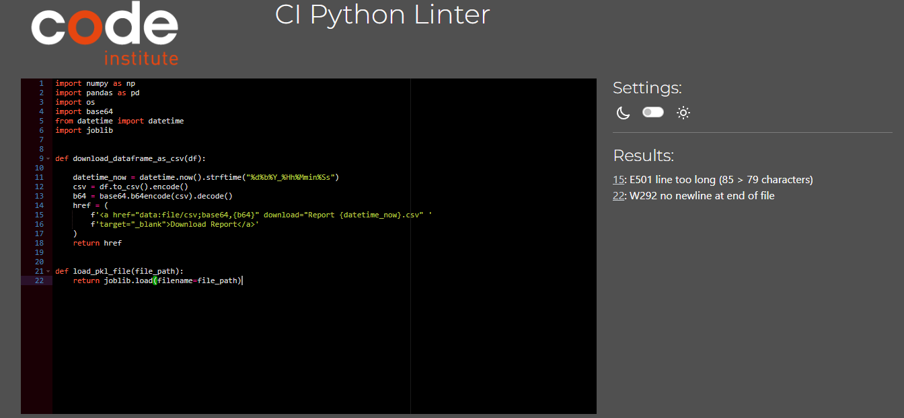</li>

 

### bugs

This is a new img of a leaf I took from the internet. We can clearly see that it's healty but still the model predict 79% chance infected with mildew. There are alot of parameters to think about when it comes to this img. First of all it looks like the leaf is not real and the all the shimmering details from the sun may confuse the model. 
#### Fixed Bugs
1. When I uploaded the project to heroku the slug was 534mb and the limit is 500. I put a few files in the .slugignore to make it down to 480mb. If you want to avoid this problem, change the img size from 254px x 254px to 127px x 127px.
2. When I was about to upload the project to heroku I got a warning for Protobuff. The version wasn't compatible with my version of Django. So when I downgraded the Protobuff I got a "optimizer Adam" error when I tried to use the ML to search for mildew in a leaf. I deleted Protobuff and installed the same version one of my classmates used and after I loaded the module again it worked as expected.
3. I had writed the code wrong in the predictive_analysis.py. I took images from the testing and tried the model. All the infected leafs was healthy and all the healthy leafs was infected accourding to the predictions. So I hade to find the error wich I found on line 17 and 56 in predictive_analysis.py where 0=Infected and 1=Healthy. 

<h3>Unfixed Bugs</h3>

None reported.

<h2 id="deployment">Deployment</h2>

The project is coded and hosted on GitHub and deployed using <a href="https://www.heroku.com/">Heroku</a>.

<h3>Creating the Heroku App</h3>
<ol>
    <li>Create a <code>requirements.txt</code> file in GitHub listing the project dependencies.</li>
    <li>Set the <code>runtime.txt</code> to a supported Heroku-20 stack version.</li>
    <li>Push the changes to GitHub and create a new app on Heroku.</li>
    <li>Add <code>heroku/python</code> buildpack from the Settings tab.</li>
    <li>From the Deploy tab, choose GitHub as the deployment method and connect to the repository.</li>
    <li>Select the branch to deploy and click Deploy Branch.</li>
    <li>Enable Automatic Deploys or deploy manually.</li>
    <li>Wait for the app to be built and deployed.</li>
    <li>Access the deployed app at <a href="https://your-projects-name.herokuapp.com/">https://your-projects-name.herokuapp.com/</a>.</li>
</ol>

<h3>Forking the Repository</h3>

Instructions for forking the repository are available on GitHub.

<h3>Making a Local Clone</h3>

Clone the repository to your local machine using <code>git clone</code>.

<strong>You can find the live link to the site here:</strong> <a href="https://flower-2-466d9dcf9bb4.herokuapp.com/">Cherry Powdery Mildew Detector</a>

<h2 id="technologies-used">Technologies Used</h2>

<h3>Platforms</h3>
<ul>
    <li><a href="https://www.heroku.com/">Heroku</a>: Used for deploying and running web applications.</li>
    <li><a href="https://jupyter.org/">Jupyter Notebook</a>: Used for developing and running Python code.</li>
    <li><a href="https://www.kaggle.com/">Kaggle</a>: Used for downloading datasets.</li>
    <li><a href="https://github.com/">GitHub</a>: Used for code storage and version control.</li>
    <li><a href="https://www.gitpod.io/">Gitpod</a>: Used for coding and committing to GitHub.</li>
</ul>

<h3>Languages</h3>
<ul>
    <li><a href="https://www.python.org/">Python</a>: The primary language used for developing the machine learning model and data analysis.</li>
    <li><a href="https://en.wikipedia.org/wiki/Markdown">Markdown</a>: Used for creating the README file and documentation.</li>
</ul>

<h3>Main Data Analysis and Machine Learning Libraries</h3>
<ul>
    <li><a href="https://www.tensorflow.org/">TensorFlow</a>: For building and training the neural network.</li>
    <li><a href="https://keras.io/">Keras</a>: High-level API for neural network creation.</li>
    <li><a href="https://pandas.pydata.org/">Pandas</a>: For data manipulation and analysis.</li>
    <li><a href="https://numpy.org/">NumPy</a>: For numerical operations.</li>
    <li><a href="https://matplotlib.org/">Matplotlib</a>: For creating visualizations.</li>
</ul>

<h2 id="credits">Credits</h2>

Special thanks to my mentor Mo for helping me!

